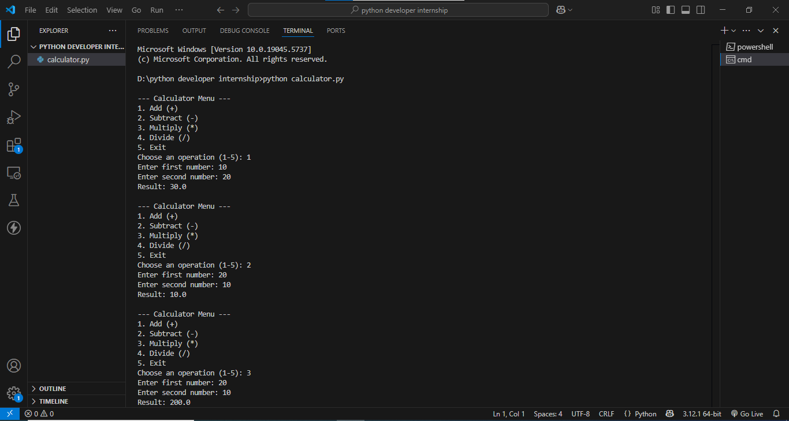
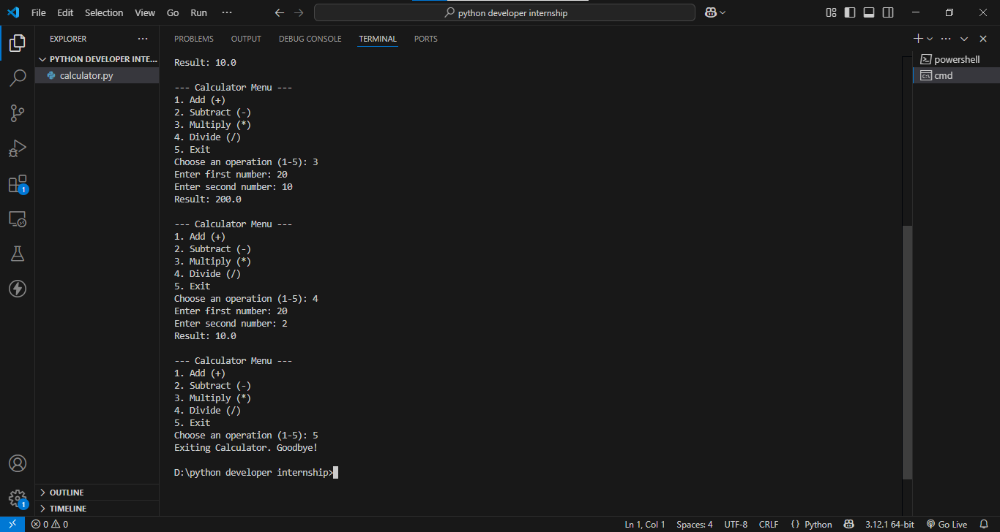

# 🧮 CLI Calculator - Python

## 📌 Description
This is a command-line calculator built using **Python**. It supports basic arithmetic operations:

- Addition (+)
- Subtraction (−)
- Multiplication (×)
- Division (÷)

It uses:
- Python functions
- User input via `input()`
- Infinite loop until the user chooses to exit

---

## 🚀 How to Run

1. Make sure you have Python installed.
2. Open terminal/command prompt.
3. Clone the repo or download the `calculator.py` file.
4. Run the script using:

```bash
python calculator.py

```


## 📸 Output





